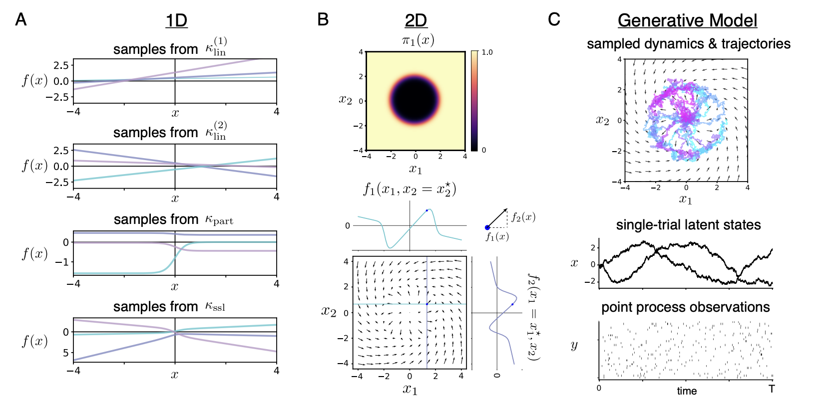

# gpSLDS

This repository contains an implementation of the Gaussian Process Switching Linear Dynamical System (gpSLDS) from our paper:

**Modeling Latent Neural Dynamics with Gaussian Process Switching Linear Dynamical Systems**  
Amber Hu, David Zoltowski, Aditya Nair, David Anderson, Lea Duncker, and Scott Linderman\
Neural Information Processing Systems (NeurIPS), 2024.\
[arXiv](https://arxiv.org/abs/2408.03330)  
[OpenReview](https://openreview.net/forum?id=LX1lwP90kt&referrer=%5Bthe%20profile%20of%20Amber%20Hu%5D(%2Fprofile%3Fid%3D~Amber_Hu1))

The gpSLDS is a probabilistic generative model for uncovering latent neural dynamics from noisy observations in terms of locally linear dynamical components. It builds off of the recurrent SLDS (Linderman et al. 2017) and its variants by more naturally handling uncertainty in dynamics. In particular, the gpSLDS imposes a novel prior on dynamics which interpolates smoothly at the boundaries between linear dynamical regimes, while also maintaining interpretable locally linear structure. It leverages a Gaussian process-stochastic differential equation framework, which allows us to model dynamics probabilistically and obtain estimates of posterior uncertainty in inferred dynamics.



## Repo structure
```
gpslds/                         Source code for gpSLDS model implementation.
    em.py                           Implements variational EM and contains the main gpSLDS fitting function.
    initialization.py               Functions for initializing model parameters.
    kernels.py                      GP kernel functions, including our smoothly switching linear kernel.
    likelihoods.py                  Gaussian and Poisson observation models.
    quadrature.py                   Quadrature object for approximating kernel expectations.
    simulate_data.py                Helper functions for sampling from the model.
    transition.py                   Defines GP object for model fitting.
    utils.py                        Variety of helper functions.
data/                           Code and data files for reproducing the main synthetic data example (Fig 2 in paper).
    fit_plds.py                     Script for fitting Poisson LDS to initialize Poisson Process observation model parameters.
    generate_synthetic_data.py      Script for generating synthetic data.
    synthetic_data.pkl              Pickle file containing synthetic data.
    synthetic_plds_emissions.pkl    Pickle file containing initial observation model parameters for synthetic data.
synthetic_data_demo.ipynb       Demo notebook fitting gpSLDS to synthetic data.
```

## Installation
We recommend installing required packages in a virtual environment with Python `3.12.1`. In your virtual environment, run
```
pip install --upgrade pip
pip install -r requirements.txt
```
This should install JAX with CUDA on your machine (along with other required packages), but JAX requirements can be system dependent. For more information, please see the official JAX installation instructions [here](https://github.com/jax-ml/jax#installation).

We recommend running the gpSLDS on a GPU backend to fully utilize computational speedups. For our paper, we ran all experiments using an NVIDIA A100 GPU. 

## Data format
To use the gpSLDS on your own data, you will need to ensure that you have:
- A JAX array `ys_binned` of shape `(n_trials, n_timesteps, n_output_dims)`. To process data in effectively continuous-time, `n_timesteps` should represent the number of time bins at a small discretization step relative to the data sampling rate. We assume that data has been zero-padded in the case of varying length trials.
- A JAX array `t_mask` of shape `(n_trials, n_timesteps)`. This is 1 for observed timesteps and 0 for unobserved timesteps.
- A JAX array `trial_mask` of shape `(n_trials, n_timesteps)`. This is 1 for timesteps in an observed trial and 0 for a zero-padded timestep.
- (Optional) A JAX array `inputs` of shape `(n_trials, n_timesteps, n_input_dims)` consisting of external stimuli.

For an example, please see `synthetic_data_demo.ipynb` which demonstrates data formatting and model fitting on a synthetic example.
