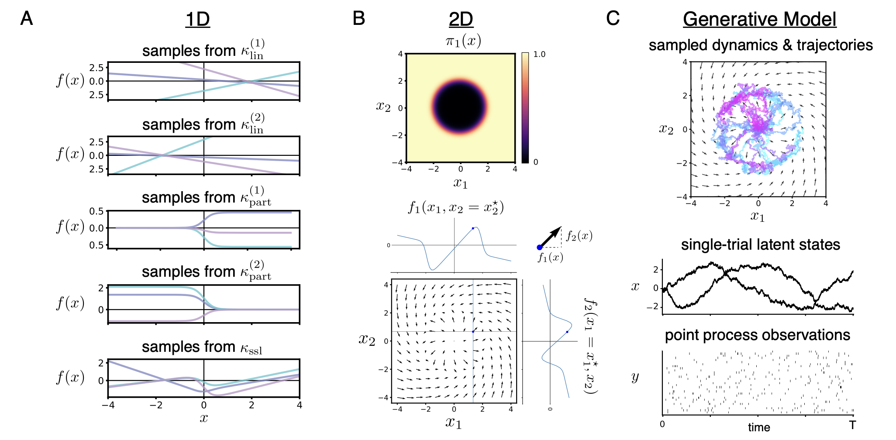

# gpSLDS

🚨 UPDATE: As of 12/2025, SING (Hu*, Smith*, Linderman; NeurIPS 2025) is the recommended inference algorithm for fitting gpSLDS models. You can find an implementation of SING and the gpSLDS model [here](https://github.com/lindermanlab/sing). 🚨

This repository contains the original implementation of the Gaussian Process Switching Linear Dynamical System (gpSLDS) from our paper:

**Modeling Latent Neural Dynamics with Gaussian Process Switching Linear Dynamical Systems**  
Amber Hu, David Zoltowski, Aditya Nair, David Anderson, Lea Duncker, and Scott Linderman\
Neural Information Processing Systems (NeurIPS), 2024.\
[arXiv](https://arxiv.org/abs/2408.03330)  
[OpenReview](https://openreview.net/forum?id=LX1lwP90kt&referrer=%5Bthe%20profile%20of%20Amber%20Hu%5D(%2Fprofile%3Fid%3D~Amber_Hu1))

The gpSLDS is a probabilistic generative model for uncovering latent neural dynamics from noisy observations in terms of locally linear dynamical components. It builds off of the recurrent SLDS (Linderman et al. 2017) and its variants by more naturally handling uncertainty in dynamics. In particular, the gpSLDS imposes a novel prior on dynamics which interpolates smoothly at the boundaries between linear dynamical regimes, while also maintaining interpretable locally linear structure. It leverages a Gaussian process-stochastic differential equation framework, which allows us to model dynamics probabilistically and obtain estimates of posterior uncertainty in inferred dynamics.



## Repo structure
```
gpslds/                         Source code for gpSLDS model implementation.
    em.py                           Implements variational EM and contains the main gpSLDS fitting function.
    initialization.py               Functions for initializing model parameters.
    kernels.py                      GP kernel functions, including our smoothly switching linear kernel.
    likelihoods.py                  Gaussian and Poisson observation models.
    quadrature.py                   Quadrature object for approximating kernel expectations.
    simulate_data.py                Helper functions for sampling from the model.
    transition.py                   Defines GP object for model fitting.
    utils.py                        Variety of helper functions.
data/                           Code and data files for reproducing the main synthetic data example (Fig 2 in paper).
    fit_plds.py                     Script for fitting Poisson LDS to initialize Poisson Process observation model parameters.
    generate_synthetic_data.py      Script for generating synthetic data.
    synthetic_data.pkl              Pickle file containing synthetic data.
    synthetic_plds_emissions.pkl    Pickle file containing initial observation model parameters for synthetic data.
synthetic_data_demo.ipynb       Demo notebook fitting gpSLDS to synthetic data.
```

## Installation
We recommend installing required packages in a virtual environment with Python version `>=3.9.0`. In your virtual environment, run
```
pip install --upgrade pip
pip install -r requirements.txt
```
This should install JAX with CUDA on your machine (along with other required packages), but JAX requirements can be system dependent. For more information, please see the official JAX installation instructions [here](https://github.com/jax-ml/jax#installation).

To install `gpslds` as a package, first clone this repo and then run the following command from the root directory.
```
pip install -e .
```
If you would like to run the demo notebook, `synthetic_data_demo.ipynb`, then you will also need to install the [ssm](https://github.com/lindermanlab/ssm) package which is used to initialize some parameters of the model.

We recommend running the gpSLDS on a GPU backend to fully utilize computational speedups. For our paper, we ran all experiments using an NVIDIA A100 GPU. 

## Data format
To fit a gpSLDS model, your data should be in the following format.
- `ys_binned`: JAX array, shape `(n_trials, n_timesteps, n_output_dims)` of noisy observations discretized to a fine time grid of width `dt`. In the case of varying trial lengths, we assume that data has been zero-padded at the end of each trial up to the maximum trial length. Here, `n_timesteps * dt = total_duration`.
- `t_mask`: JAX array, shape `(n_trials, n_timesteps)`. This is a binary mask to handle irregularly-sampled observations, with value 1 for observed timesteps and 0 for unobserved timesteps.
- `trial_mask`: JAX array, shape `(n_trials, n_timesteps)`. This is a binary mask to handle varying trial lenths, with value 1 for timesteps belonging to the observed part of the trial and 0 for timesteps that have been zero-padded. 
- (Optional) `inputs`: JAX array, shape `(n_trials, n_timesteps, n_input_dims)` representing known external inputs to the system.

For more details, please see `synthetic_data_demo.ipynb` which demonstrates data formatting and model fitting on a synthetic data example.

## Citation
Please use the following citation for our work:
```
@inproceedings{hu2024modeling,
  title={Modeling Latent Neural Dynamics with Gaussian Process Switching Linear Dynamical Systems},
  author={Hu, Amber and Zoltowski, David and Nair, Aditya and Anderson, David and Duncker, Lea and Linderman, Scott},
  booktitle={Advances in Neural Information Processing Systems},
  year={2024},
  url={https://doi.org/10.48550/arXiv.2408.03330}
}
```
